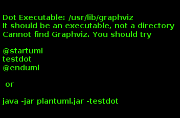

= Easy Eent
:toc:

:sectnums:

== Server

=== Model

1. API

/v0/events  GET, POST o
/v0/events/{eventId} GET, PUT, DELETE o
/v0/events/{eventId}/expenses GET, POST
/v0/events/{eventId}/participant GET

/v0/expenses  GET {id_list}
/v0/expenses/{expensesId} GET, PUT, DELETE
/v0/expenses/{expensesId}/contributions GET

/v0/participants  GET {id_list}
/v0/participants/{participantId} GET, PUT, DELETE
/v0/participants/{participantId}/contributions GET

2. Domain

